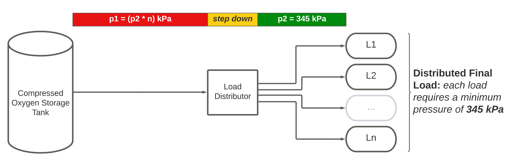
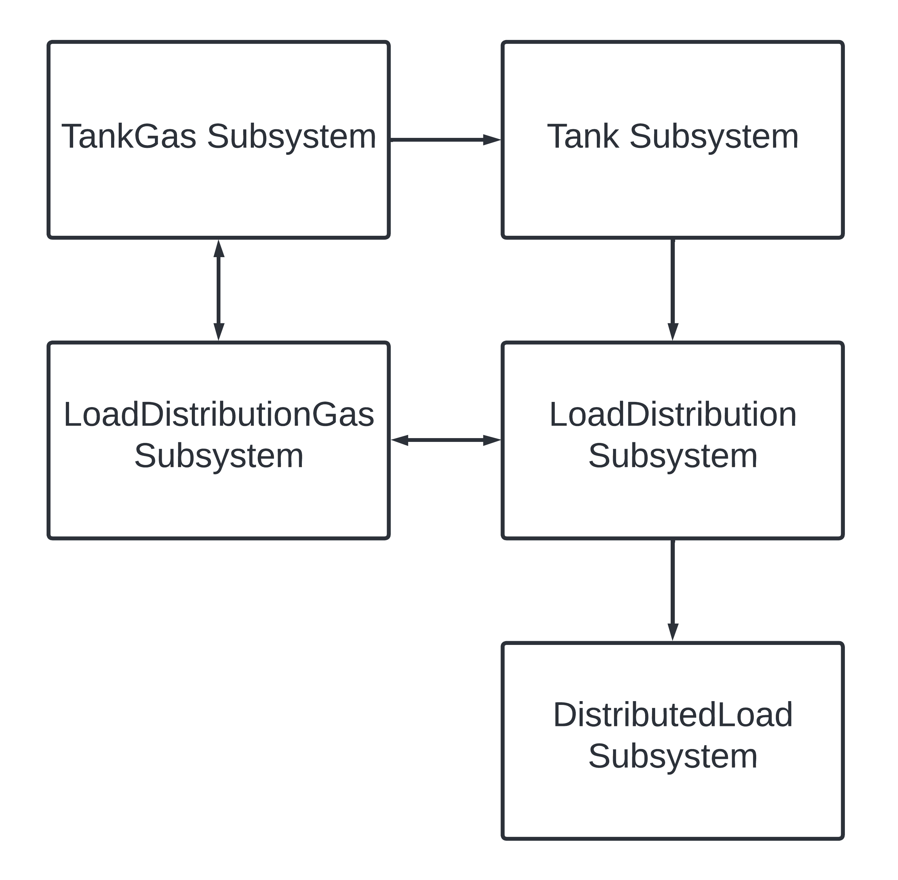
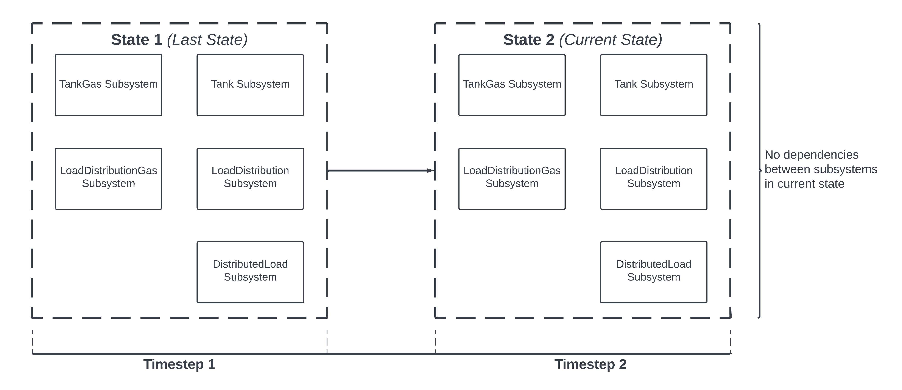

# Situational Context  

## Note  
Going to keep it simple for now, will increase complexity later. Worry strictly about usage/rate of change of volume

### Environment  
Oxygen gas in a hospital.  

### System Diagram  

### Gas Demand
`5000000 Litres / day`. Random estimate. Will need to simulate load for accuracy.

Avg LPM calculation, based on one day's demand: `5000000 L/d / (24 h/d * 60 m/h) = 3472.22222 L/min`  

### Storage  
For initial development, assume simple configuration of a single, compressed gas-filled vessel. 

The vessel has a `10000` L capacity, assume for now 100% pure oxygen.

Final product should support liquid storage vessel and cylinder manifold system. 

### Measurement  
Since inside of the tank is air in our idealized environment, we're using a pressure sensor. 

## CSA Standards
1. CSA [1, pg. 82] says that, for Oxygen supply:
- **Nominal Pressure:** 345 +35/-0 kPa
- **Typical Flows at Standard T (0 c) and P (100 kPa):**
  - Ventilator: 25 L/min 
  - Flowmeter: 2-10 L/min
  - Blender: 5-10 L/min
  - **Outlet Max: 25 L/min**

2. Low pressure is anything less than 1380 kPa (200 psi). ASSUMPTION: everything including or above 1380 kPa (200 psi) is high pressure.

# Sources
Saudi Journal of Anaesthesia [https://www.ncbi.nlm.nih.gov/pmc/articles/PMC8477771/](https://www.ncbi.nlm.nih.gov/pmc/articles/PMC8477771/)

On liquid oxygen systems: https://pib.gov.in/PressReleasePage.aspx?PRID=1716197 

On ventilators: https://www.lhsc.on.ca/critical-care-trauma-centre/mechanical-ventilator 

On hospital oxygen gas systems: https://www.ncbi.nlm.nih.gov/pmc/articles/PMC8680427/ 

[1] CSA standard on medical gases: https://www.csagroup.org/store/product/Z7396.1-17/  

# Miscellaneous  
## Eventual Load Simulation   
Will need to simulate actual hospital usage eventually. 

## Simulator Time Stuff  
This simulation is capable of both real-time, and of time-scaled simulation. The modality is controllable by changing `config.ini`:
- For real-time simulation, set `SIMULATION_TIME_SCALE_FACTOR = 1.0`
- For slowed simulation, set `SIMULATION_TIME_SCALE_FACTOR < 1.0`
- For accelerated simulation, set `SIMULATION_TIME_SCALE_FACTOR > 1.0`

I've made it so that the length of the simulated timestep can be altered also. This is primarily to allow simulation of the simulated system in durations of less than a second.

| TScF  | TStL | Real Life Time per 60 s Simulated Time | Number of Simulated Timesteps |
|-------|------|----------------------------------------|-------------------------------|
| 1.0   | 1.0  | 60 s                                   | 60                            |
| 2.0   | 1.0  | 30 s                                   | 60                            |
| 1.0   | 0.5  | 60 s                                   | 120                           |
| 60.0  | 0.5  | 2 s                                    | 120                           |
| 120.0 | 0.5  | 1 s                                    | 120                           |

## Floating Point Arithmetic/Related Variable Naming  
Since the simulation requires a lot of floating point arithmetic, I am using the decimal module provided by python https://docs.python.org/3/library/decimal.html. I am aiming to make all floating point numbers required for math of the Decimal type for homology in the greater pursuit of reliability. 

I am attempting to specify the type of anything that is NOT a Decimal type, but IS conceivably represented as a floating point number. For example, in the simulation code (`src/simulation.py` right now), the timestep length is kept internally in the Simulation object as both a float and a Decimal type. 

The float type is required at the end of every timestep, because time.sleep() only takes primitive types as an argument. However, the timestep length will reasonably need to be used for math in the simulation. Any physics engine for example will absolutely require interaction with the length of the timestep, even for trivial calculations (e.g. velocity = d/t). 

I am keeping both a float and a Decimal type to minimize `float -> Decimal` and `Decimal -> float` conversions for two reasons:
1. They are expensive;
2. They will be frequent, occurring once every timestep (at least).

Hence, the public (Decimal-type) constant (`SIMULATION_TIMESTEP_LENGTH_SECONDS`) does not have a type specification nor a leading hyphen to indicate its use internally to the Simulation class. Whereas, the float constant (`_SIMULATION_TIMESTEP_REAL_LENGTH_SECONDS`) does have both a type specification, and a leading hyphen.  

## Simulated System  
The simulator works by controlling the state of a system. When the simulator *updates* every timestep, it *advances* the simulated system to a new state - the next state. The system's next state will be simulated by referencing the system's current state.  

The system is made of system components. These system components together may form smaller subsystems, which themselves are also systems. A subsystem can be simulated independently using the current state of itself, but also the current state of other subsystems.  

As previously illustrated, systems may be comprised of subsystems. This model of classification may result in a sort of recursive object structure. By way of example: System A may be composed of Subsystem B and C. Subsystem B is composed of Subsystem B1, B2, B3. Subsystem C is composed of Subsystem C1, C2, etc. This means that a subsystem can actually be viewed both as a System in and of itself, but also as a SystemComponent of a parent system.  

As such, I am going to generalize the idea of a SystemComponent to just be represented by a SubSystem. System will be the *root* class of represented system. It tracks the topology and interconnection of the modelled system. Since SubSystems can be Systems too, SubSystem can be the same class as System.  

### Simulation Scheme  
A system, when discretely componentized, will have subsystems which rely on the state of other subsystems. The way I see it right now, there are two ways to approach this idea of order in simulation:
1. Simulate subsystems solely based on the previous state of the system *(Last State-based Simulation (LSS));*
2. Simulate subsystems in a priority queue-like way, simulating dependency subsystems before dependent subsystems *(Current State, Order-based Simulation (CSOS))*.  

The second one came to me first, and seems initially more intuitive. The first one makes more sense though I think, and would allow for parallel computation so it would be much faster.  

Just took a walk and the first one, LSS, sounds way better. All next subsystem states are determined completely independently of other next subsystem states. Since external actions will need to wait to have an effect on the system until the next sim timestep anyways, this has no affect on simulation accuracy as far as I can see it. 

Moreover, the simulation should be running at a low enough TStL (probably like `5000 Hz` so `TStL = 0.0002`) to where any external effect on the system (e.g. load increase/decrease, sudden leak, emergency shutoff, etc.) will be accounted for essentially as soon as it happens. I don't think the perceived initial intrinsic benefits of generating each subsystem state sequentially per timestep and using the output thereof for the generation of the next subsystem (CSOS) outweigh or even compare to the benefits of an independent, last state-based simulation scheme as proposed here. 

In LSS, dependencies between various subsystems can exist, yet their calculation is independent. For example, if a Tank subsystem needs interaction with a Gas subsystem, a Tank subsystem needs interaction with a Load Distribution subsystem, a Load Distribution subsystem needs interaction with a Distributed Load subsystem, etc., none of these dependencies will be blocked by each others' calculations in a single timestep. Their current state is instead calculated by the state of their dependency subsystems in the *greater system's last state.* 

### Last State-based Simulation Example  
Consider this sample system which we are interested in simulating (note that this is not reflective of the actual system we want to model here; it is an example):  

How could we simulate this system dependently in one step with this many interdependencies? Well, with Last State-based Simulation, we don't need to worry about it because we can just use the last representation of the system:  
 

The state represented by the dashed boxes around all the subsystems represents the state of the whole system. In other words, it represents the system boundary. 

Perhaps, accessing the last state of the greater system as a whole and the subsystems within it could be done via some kind of interface mechanism with the System class.

**unfortunately for now i will be using CSOS. LSS is difficult to implement because it is very complex to remember what specifically is calculated before what. LSS will be implemented when sensors are a thing. It makes sense that sensors would be delayed**